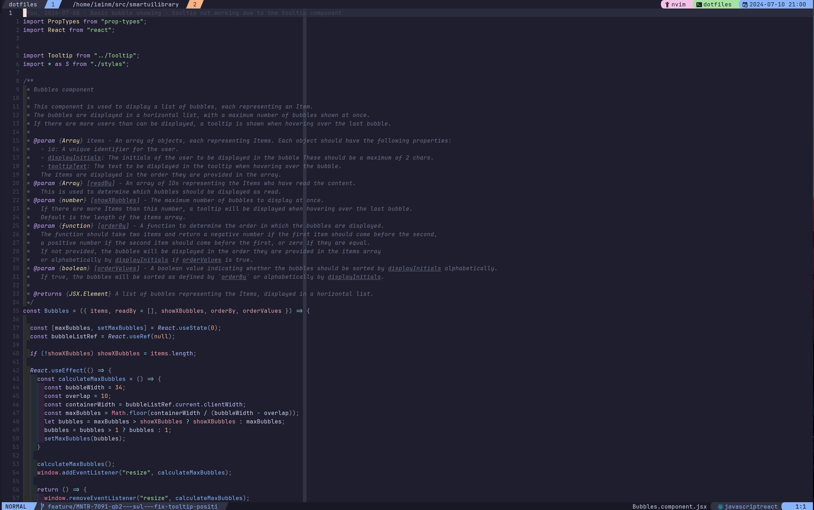
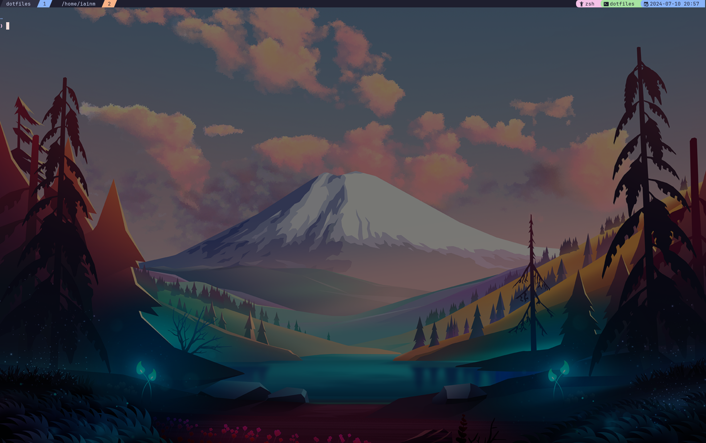

# Dotfiles.iainm

Personal setup primarily using [ Wezterm ]( https://wezfurlong.org/wezterm/index.html ),
[ Neovim ]( https://neovim.io/ ) in Ubuntu wsl.

Slowly moving away from VSCode to have more fun messing about with my configs.

Primarily setup for Python, Go, Javascript/Typescript programming.

Note taking using [Obsidian](https://obsidian.md).

* Python
* Go
* Javascript/Typescript
* Obsidian

> NB: Install scripts exist but are far from tested on each environment.
